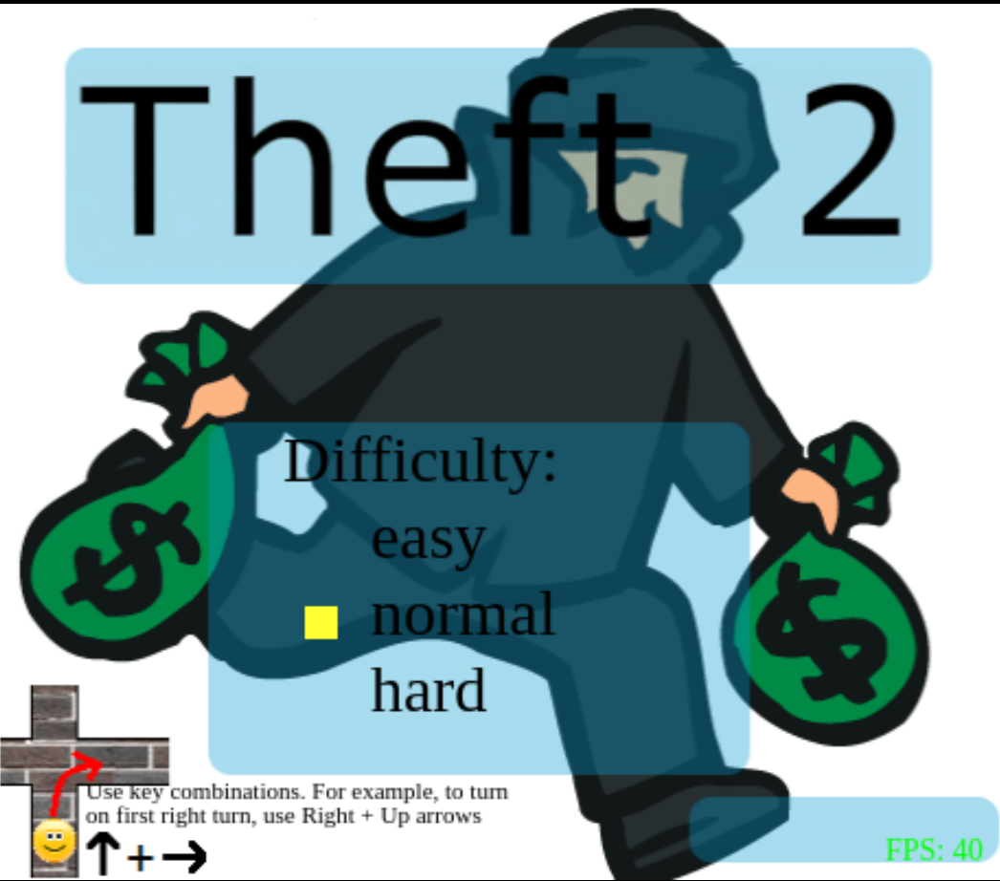
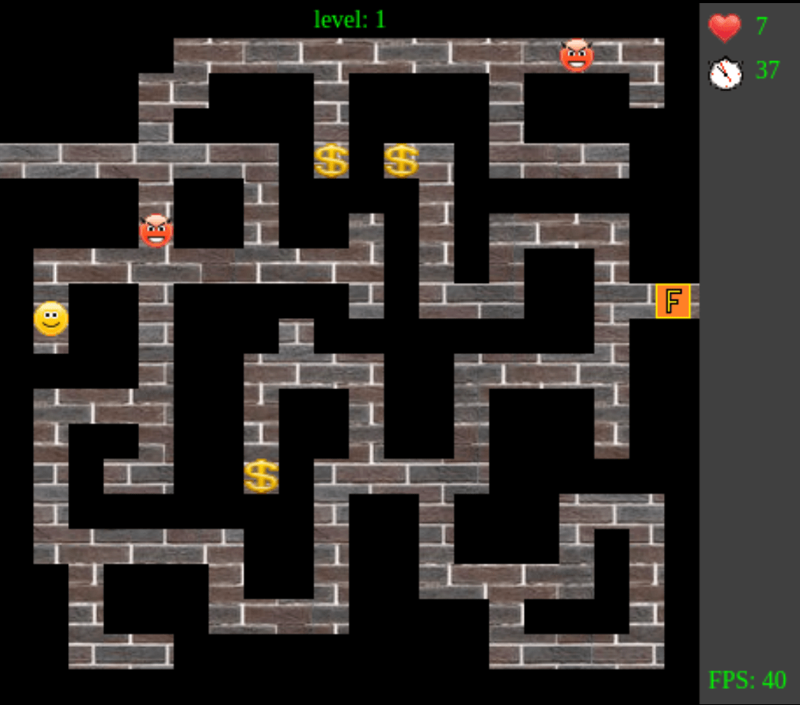
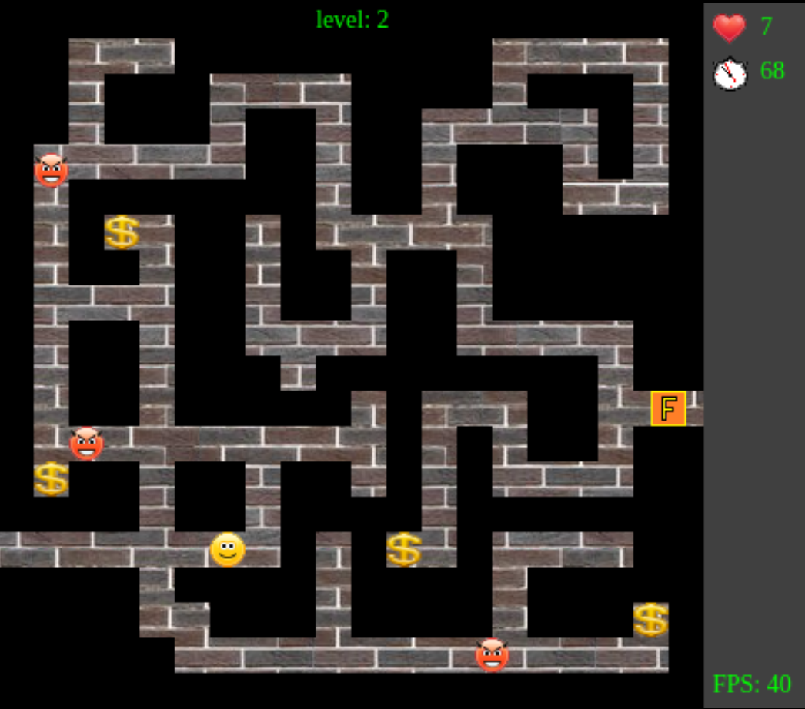

This is my 2D game, developed entirely in vanilla JavaScript. It was written around 2012, a time when inheritance in JS was still implemented using prototypes, and tools like Webpack were not yet common.

A keyboard is required to play, as the game is controlled by key presses.

The Goal: Collect all the dollars($), avoid the guards(angry faces), and find the exit from the maze(marked with the letter F). The game has 4 levels. Completing them leads to an unexpected ending.

[Click to Play](https://evolutionofants.click/theft2_mini_game)

